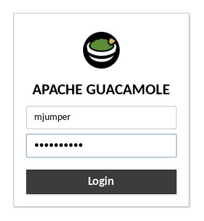
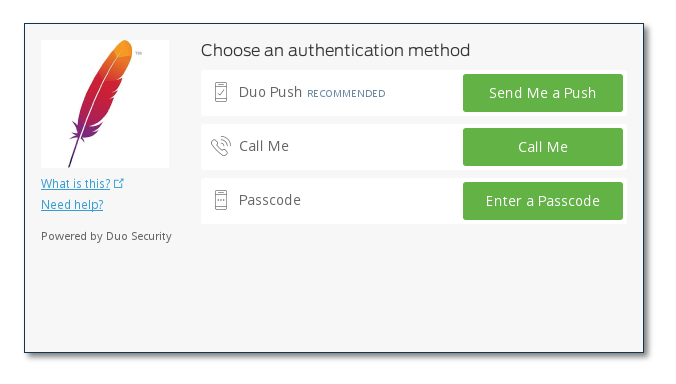

(duo-auth)=

Duo two-factor authentication
=============================

Guacamole supports Duo as a second authentication factor, layered on top
of any other authentication extension, including those available from
the main project website. The Duo authentication extension allows users
to be additionally verified against the Duo service before the
authentication process is allowed to succeed.

:::{important}
This chapter involves modifying the contents of `GUACAMOLE_HOME` - the
Guacamole configuration directory. If you are unsure where `GUACAMOLE_HOME` is
located on your system, please consult [](configuring-guacamole) before
proceeding.
:::

(duo-architecture)=

How Duo works with Guacamole
----------------------------

Guacamole provides support for Duo as a second authentication factor. To
make use of the Duo authentication extension, some other authentication
mechanism will need be configured, as well. When a user attempts to log
into Guacamole, other installed authentication methods will be queried
first:



Only after authentication has succeeded with one of those methods will
Guacamole reach out to Duo to obtain additional verification of user
identity:



If both the initial authentication attempt and verification through Duo
succeed, the user will be allowed in. If either mechanism fails, access
to Guacamole is denied.

(duo-downloading)=

Downloading the Duo extension
-----------------------------

The Duo authentication extension is available separately from the main
`guacamole.war`. The link for this and all other officially-supported
and compatible extensions for a particular version of Guacamole are
provided on the release notes for that version. You can find the release
notes for current versions of Guacamole here:
http://guacamole.apache.org/releases/.

The Duo authentication extension is packaged as a `.tar.gz` file
containing only the extension itself, `guacamole-auth-duo-1.3.0.jar`,
which must ultimately be placed in `GUACAMOLE_HOME/extensions`.

(installing-duo-auth)=

Installing Duo authentication
-----------------------------

Guacamole extensions are self-contained `.jar` files which are located
within the `GUACAMOLE_HOME/extensions` directory. To install the Duo
authentication extension, you must:

1. Create the `GUACAMOLE_HOME/extensions` directory, if it does not already
   exist.

2. Copy `guacamole-auth-duo-1.3.0.jar` within `GUACAMOLE_HOME/extensions`.

3. Configure Guacamole to use Duo authentication, as described below.

:::{important}
You will need to restart Guacamole by restarting your servlet container in
order to complete the installation. Doing this will disconnect all active
users, so be sure that it is safe to do so prior to attempting installation. If
you do not configure the Duo authentication properly, Guacamole will not start
up again until the configuration is fixed.
:::

### Adding Guacamole to Duo

Duo does not provide a specific integration option for Guacamole, but
Guacamole's Duo extension uses Duo's generic authentication API which
they refer to as the "Web SDK". To use Guacamole with Duo, you will need
to add it as a new "Web SDK" application from within the "Applications"
tab of the admin panel of your Duo account:


Within the settings of the newly-added application, rename the
application to something more representative than "Web SDK". This
application name is what will be presented to your users when they are
prompted by Duo for additional authentication:


Once you've finished adding Guacamole as an "Web SDK" application, the
configuration information required to configure Guacamole is listed
within the application's "Details" section. You will need to copy the
integration key, secret key, and API hostname - they will later be
specified within `guacamole.properties`:


(guac-duo-config)=

### Configuring Guacamole for Duo

The application-specific configuration information retrieved from Duo
must be added to `guacamole.properties` to describe how Guacamole
should connect to the Duo service:

duo-api-hostname
: The hostname of the Duo API endpoint to be used to verify user identities.
  This will usually be in the form `api-XXXXXXXX.duosecurity.com`, where
  "XXXXXXXX" is some arbitrary alphanumeric value assigned by Duo. This
  value will have been generated by Duo when you added Guacamole as an "Web
  SDK" application, and can be found within the application details in the
  "API hostname" field. *This value is required.*

duo-integration-key
: The integration key provided for Guacamole by Duo. This value will
  have been generated by Duo when you added Guacamole as an "Web SDK"
  application, and can be found within the application details in the
  "Integration key" field. *This value is required and must be EXACTLY
  20 characters.*

duo-secret-key
: The secret key provided for Guacamole by Duo. This value will have
  been generated by Duo when you added Guacamole as an "Web SDK"
  application, and can be found within the application details in the
  "Secret key" field. *This value is required and must be EXACTLY 40
  characters.*

In addition to the above, *you must also manually generate an
"application key"*. The application key is required by Duo's
authentication API, but is not provided by Duo. It is an arbitrary value
meant to be unique to each deployment of an application using their API.

duo-application-key
: An arbitrary, random key which you manually generated for Guacamole.
  *This value is required and must be AT LEAST 40 characters.*

The application key can be generated with any method as long as it is
sufficiently random. There exist utilities which will do this for you, like
`pwgen`:

```console
$ pwgen 40 1
em1io4zievohneeseiwah0zie2raQuoo2ci5oBoo
$
```

Alternatively, one quick and fairly portable way to do this is to use the `dd`
utility to copy random bytes from the secure random device `/dev/random`,
sending the data through a cryptographic hash tool with a sufficiently-long
result, like `sha256sum`:

```console
$ dd if=/dev/random count=1 | sha256sum
5d16d6bb86da73e7d1abd3286b21dcf3b3e707532e64ceebc7a008350d0d485d -
$
```

(completing-duo-install)=

### Completing the installation

Guacamole will only reread `guacamole.properties` and load newly-installed
extensions during startup, so your servlet container will need to be restarted
before Duo authentication will take effect.  Restart your servlet container and
give the new authentication a try.

:::{important}
You only need to restart your servlet container. *You do not need to restart
guacd*.

guacd is completely independent of the web application and does not deal with
`guacamole.properties` or the authentication system in any way. Since you are
already restarting the servlet container, restarting guacd as well technically
won't hurt anything, but doing so is completely pointless.
:::

If Guacamole does not come back online after restarting your servlet
container, check the logs. Problems in the configuration of the Duo
extension may prevent Guacamole from starting up, and any such errors
will be recorded in the logs of your servlet container.

