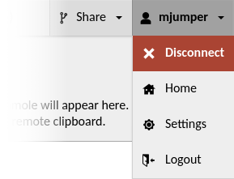
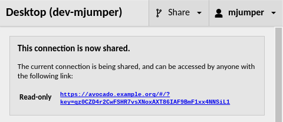
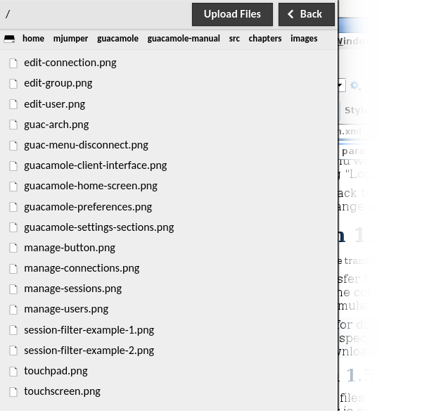
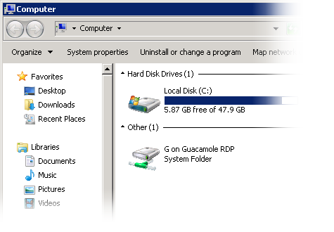
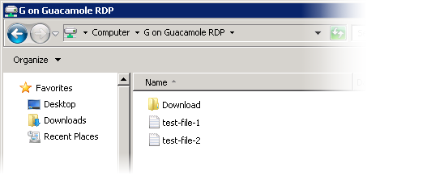
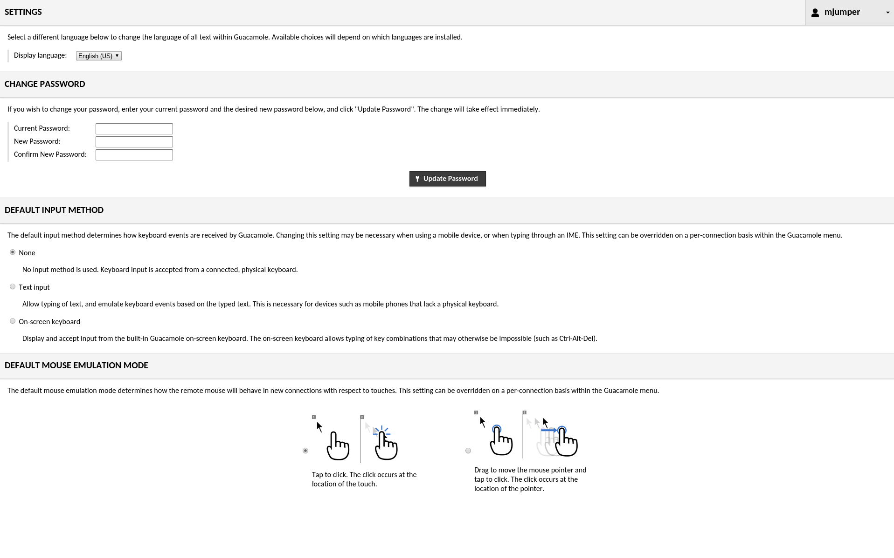

Using Guacamole
===============

Guacamole provides access to much of the functionality of a desktop from within
your web browser. Although most people use remote desktop tools only when
absolutely necessary, we believe that Guacamole must be aimed at becoming a
primary means of accessing desktops, and the interface is thus intended to be
as seamless and unobtrusive as possible.

Home screen
-----------

Once you have successfully logged in, you will be taken to either the Guacamole
home screen, where all available connections are listed, or directly to a
connection, if you only have access to one connection.

The home screen will contain a list of all connections to which you have
access, along with thumbnails of any recently used or active connections. If
you have access to a large number of connections and wish to quickly locate a
specific connection, you can also enter search terms within the "Filter" field
to filter the list of connections by name.


Clicking on any connection will open that connection within the current window
or tab, but multiple connections can be used simultaneously. You can easily
navigate back to the home screen without disconnecting by using your browsers
back button or the "Home" button in the Guacamole menu. Each connection you use
will remain active until explicitly disconnected, or until you navigate away
from Guacamole entirely. Active connections can be seen as thumbnails updating
in real-time on the home screen.

### User menu

With the exception of the client screen discussed below, all Guacamole screens
contain a menu in the upper-right corner called the "user menu".  This menu
displays your username and contains several options which depend on your user's
level of access:

Home
: Navigates back to the home screen, if you are not already there. If you only
  have access to one connection, this will be replaced with a link to that
  connection.

Settings
: Navigates to the settings interface, which provides access to user
  preferences such as display language. If you have access to administrative
  functions, those are found within the settings interface, as well, and are
  discussed in more detail in [](administration).

Logout
: Logs out of Guacamole completely, closing all current connections and ending
  the Guacamole session.

Client screen
-------------

Once you open a connection, you will see a real-time view of the remote
display. You can interact with this display just as you would your normal
desktop. Your mouse and keyboard will function as if they were connected
directly to the remote machine.


The remote display will take up the entire browser window, with no buttons or
menus to disturb the view. With the intent of providing a seamless experience,
options specific to remote desktop are hidden within the Guacamole menu, which
can be opened as needed.

(guacamole-menu)=

### The Guacamole menu

The Guacamole menu is a sidebar which is hidden until explicitly shown.  On a
desktop or other device which has a hardware keyboard, you can show this menu
by pressing {kbd}`Ctrl+Alt+Shift`. If you are using a mobile or touchscreen
device that lacks a keyboard, you can also show the menu by swiping right from
the left edge of the screen. To hide the menu, you press {kbd}`Ctrl+Alt+Shift`
again or swipe left across the screen.

The Guacamole menu provides options for:

* [Navigating back to the home screen](client-user-menu)

* [Sharing the current connection](client-share-menu)


* [Reading from (and writing to) the clipboard of the remote
  desktop](using-the-clipboard)

* [Uploading and downloading files](file-transfer)

* [Selecting alternative methods of typing or controlling the mouse,
  particularly for use on mobile or touchscreen devices](touch-devices)

* [Zooming in and out of the remote display](scaling-display)

* [Disconnecting from the current connection entirely](client-user-menu)

(using-the-clipboard)=

Copying/pasting text
--------------------

At the top of the Guacamole menu is a text area labeled "clipboard"
along with some basic instructions:

> Text copied/cut within Guacamole will appear here. Changes to the text below
> will affect the remote clipboard.

The text area functions as an interface between the remote clipboard and the
local clipboard. Text from the local clipboard can be pasted into the text
area, causing that text to be sent to the clipboard of the remote desktop.
Similarly, if you copy or cut text within the remote desktop, you will see that
text within the text area, and can manually copy it into the local clipboard if
desired.

(client-user-menu)=

Disconnecting and navigation
----------------------------

When you are done using the current connection, or you wish to navigate
elsewhere temporarily, options to do so are within the user menu inside the
Guacamole menu:



The user menu within the Guacamole menu provides an additional "Disconnect"
option that allows you to explicitly close the current connection only.
Clicking "Logout" will also implicitly disconnect all active connections,
including the current connection.

Navigating back to the home screen or to the settings screen will not
disconnect you: your connection will continue running in the background while
you change settings or initiate another connection, and you can resume any
active connection by clicking on it within the home screen.

(client-share-menu)=

Sharing the connection
----------------------

If the Guacamole server is configured to allow connection sharing, and you have
been granted permission to share the current connection, an additional "Share"
menu will appear next to your username in the Guacamole menu. Clicking on this
menu opens a list of options for sharing the current connection.


Clicking any of the options within the "Share" menu will immediately generate a
unique share link which can be distributed to anyone, even to users which do
not otherwise have accounts within the same Guacamole system.



When the link is visited, that user will be given temporary access to your
connection, restricted according to the sharing option chosen. This access, and
the validity of the link overall, lasts only until you disconnect. Once the
connection is closed, the link ceases to be valid, and any users sharing the
connection with you will be disconnected.

(file-transfer)=

Transferring files
------------------

You can transfer files back and forth between your local computer and the
remote desktop if it is supported by the underlying protocol and enabled on the
connection. Currently, Guacamole supports file transfer for VNC, RDP, and SSH,
using either the native file transfer support of the protocol or SFTP.

Files can be transferred to the remote computer by dragging and dropping the
files into your browser window, or through using the file browser located in
the Guacamole menu.

(file-browser)=

### Using the file browser

If file transfer is enabled on the connection, you will see one or more
filesystem devices listed within the Guacamole menu. Clicking on one of the
filesystems opens a file browser which lists the files and directories within
that filesystem.



Double-clicking on any directory will change the current location of the file
browser to that directory, updating the list of files shown as well as the
"breadcrumbs" at the top of the file browser. Clicking on any of the directory
names listed in the breadcrumbs will bring you back to that directory, and
clicking on the drive icon on the far left will bring you all the way back to
the root level.

Downloads are initiated by double-clicking on any file shown, while uploads are
initiated by clicking the "Upload Files" button. Clicking "Upload Files" will
open a file browsing dialog where you can choose one or more files from your
local computer, ultimately uploading the selected files to the directory
currently displayed within the file browser.

The state of all file uploads can be observed within the notification dialog
that appears once an upload begins, and can be cleared once completed by
clicking the "Clear" button. Downloads are tracked through your browser's own
download notification system.


When you are done browsing the filesystem and transferring files, click "Back"
to return to the Guacamole menu.

(rdp-virtual-drive)=

### The RDP virtual drive

RDP provides its own native support for file transfer called "drive
redirection" or "RDPDR". Guacamole provides support for this mechanism by
emulating a virtual drive. Typically, this virtual drive will appear as a
network drive within the RDP session. Files uploaded and downloaded will be
preserved within this drive, even after disconnecting.



Files can be downloaded from this drive using the file browser in the Guacamole
menu or using the special "Download" folder within the virtual drive. All files
dropped into this folder will automatically begin uploading to the client, and
thus downloading through the browser.



(guacctl)=

### {program}`guacctl` / {program}`guacget`

In addition to traditional drag-and-drop and the file browser, Guacamole's SSH
support can be used with the {program}`guacctl` utility. The {program}`guacctl`
utility is a simple shell script [included with Guacamole][guacctl] which
allows you to use and configure file transfer directly from the command line
within the SSH session:

```console
$ guacctl
guacctl 0.8.0, Guacamole SSH session control utility.
Usage: guacctl [OPTION] [FILE]...

    -d, --download         download each of the files listed.
    -s, --set-directory    set the destination directory for future uploaded 
                           files.
$ guacctl -d FILENAME
$ guacctl -s DIRECTORY
$
```

For convenience, you may also create a symbolic link or alias to
{program}`guacctl` called {program}`guacget`. When run as {program}`guacget`,
the utility behaves as if the `--download` option were supplied and initiates a
download for each file specified on the command line.

[guacctl]: https://raw.githubusercontent.com/apache/guacamole-server/master/bin/guacctl

(using-the-osk)=

On-screen keyboard
------------------

Certain key combinations are impossible to press within a web application like
Guacamole because they are reserved by the operating system
({kbd}`Ctrl+Alt+Del` or {kbd}`Alt+Tab`, for example) or by the web browser. If
you press one of these reserved combinations, the effect will be observed
locally, not remotely, and the remote desktop will receive only some of the
keys.

Guacamole provides its own, built-in on-screen keyboard which allows keys to be
sent to the remote desktop without affecting the local system. If the device
you're using does not have certain keys which the remote desktop depends on,
such as the arrow keys or {kbd}`Ctrl`, you can use the on-screen keyboard for
this, too. You can show the on-screen keyboard by selecting the "On-screen
keyboard" option from the menu.

Clicking (or tapping) the buttons of the on-screen keyboard has the same effect
as pressing the same buttons on a real keyboard, except that the operating
system and browser will not intercept these keypresses; they will only be sent
to the remote desktop.

(scaling-display)=

Scaling the display
-------------------

Guacamole will default to shrinking or expanding the remote display to fit the
browser window exactly, but this is not necessarily ideal. If the remote
display is much larger than your local display, the screen may be impossible to
see or interact with. This is especially true for mobile phones, whose screens
need to be small enough to fit in the average hand.

You can scale the display on touch devices by using the familiar pinch gesture.
Place two fingers on the screen and bring them closer together to zoom out or
further apart to zoom in.

If your device lacks a touch screen, you can also control the zoom level
through the menu. The controls for zooming in and out are located at the bottom
of the menu. The current zoom level is displayed between two "-" and "+"
buttons which control the zoom level in 10% increments.

(touch-devices)=

Mobile or touch devices
-----------------------

Guacamole is designed to work equally well across all HTML5 browsers, including
those of mobile devices. It will automatically handle input from a touch screen
or a traditional mouse (or both, if you happen to have such a gifted computer),
and provides alternative input methods for devices which lack a physical
keyboard.

(touch-mouse)=

### Mouse emulation

In the case that your device has a touchscreen and lacks a mouse, Guacamole
will emulate a mouse for the sake of interacting with remote desktops that
expect mouse input. By default, Guacamole uses "absolute" mouse emulation. This
means that the mouse pointer is positioned at the location of each tap on the
screen.

In both absolute and relative modes, you can click-and-drag by tapping the
screen and then quickly placing your finger back down. This gesture only causes
the mouse button to press down, but does not release it again until you lift
your finger back up.

(absolute-mouse-emulation)=

#### Absolute mode (touchscreen)

Absolute mouse emulation is the default as it tends to be what people expect
when using a touch device to interact with applications designed for mouse
input.

Each tap on the screen is translated into a left-click at that position.
Right-clicking is accomplished through pressing and holding your finger on the
screen. If parts of the remote display are off-screen, you can drag your finger
around the screen to pan the off-screen parts back into view.

Although absolute mouse emulation works generally well, a finger makes for a
very inaccurate pointing device. To address this, Guacamole also provides
"relative" mouse emulation. Relative mouse emulation provides a way to deal
with the need for accurate pointer control, when a true pointer device is not
present.


(relative-mouse-emulation)=

#### Relative mode (touchpad)

Guacamole's relative mouse emulation behaves similarly to the touchpad present
on most modern laptops. You drag your finger across the display to move the
mouse pointer, and tap the display to left-click. The pointer moves relative to
the motion of your finger. Right-clicking is accomplished with a two-finger
tap, and middle-clicking with a three-finger tap. The mouse scroll wheel can be
operated by dragging two fingers up or down.

Because the relative mouse emulation reserves so many gestures for the
different mouse buttons and actions, common touch gestures like panning and
pinch-to-zoom will not work while relative mouse emulation is enabled. Instead,
the screen will automatically pan to keep the mouse pointer in view, and you
can zoom through the buttons in the menu.


(text-input)=

### Typing without a physical keyboard

Many mobile devices lack a physical keyboard entirely, and instead provide
their own on-screen keyboards. As these are not true keyboards per se and do
not produce key presses, Guacamole's text input mode is required for typing on
these platforms.

"Text input" allows input of keystrokes based on the input of text.  Choosing
"Text input" tells Guacamole to infer keystrokes by tracking text entered,
rather than relying on actual key presses. Guacamole will instead determine the
combination of keypresses necessary to produce the same pattern of input,
including deletions.

If you wish to type via an IME (input method editor), such as those required
for Chinese, Japanese, or Korean, text input mode is required for this as well.
Such IMEs function through the explicit insertion of text and do not send
traditional key presses. Using text input mode within Guacamole thus allows you
to use a locally-installed IME, without requiring the IME to be installed on
the remote desktop.

(preferences)=

Changing preferences
--------------------

User preferences can be changed within the settings screen. These preferences
are stored locally within the browser, so if you use multiple computers to
access Guacamole, you can have different settings for each location. The
settings screen allows users to change the language of the Guacamole interface,
to change the default input method used by Guacamole connections, and to change
the default mouse emulation mode for if a touch device is used. If you have
sufficient permissions, you may also change your password, or administer the
system.



### Display language

The Guacamole interface is currently available in English, Dutch, French,
German, Italian, and Russian. By default, Guacamole will attempt to determine
the appropriate display language by checking the language preferences of the
browser in use. If this fails, or the browser is using a language not yet
available within Guacamole, English will be used as a fallback.

If you wish to override the current display language, you can do so by
selecting a different language within the "Display language" field. The change
will take effect immediately.

(changing-password)=

### Changing your password

System administrators can restrict the ability of individual users to change
their own passwords, so this section may not always be available.  If your
account *does* have permission, the preferences screen will contain a "Change
Password" section.

To change your password, you must provide your current password, enter the
desired new password, and click "Update Password". You will remain logged in,
and the change will affect any future login attempt.

### Default input settings

Guacamole provides multiple keyboard input methods and multiple mouse emulation
modes. Many of these settings are specifically useful for touch devices, while
others are aimed mainly at traditional desktop use.  By default, Guacamole will
use the keyboard and mouse modes most commonly preferred by users, but you can
change these defaults if they do not fit your tastes or your current device.

The choices available mirror those within the Guacamole menu discussed earlier
in this chapter, and changing these settings will affect the default values
selected within the Guacamole menu of future connections.

